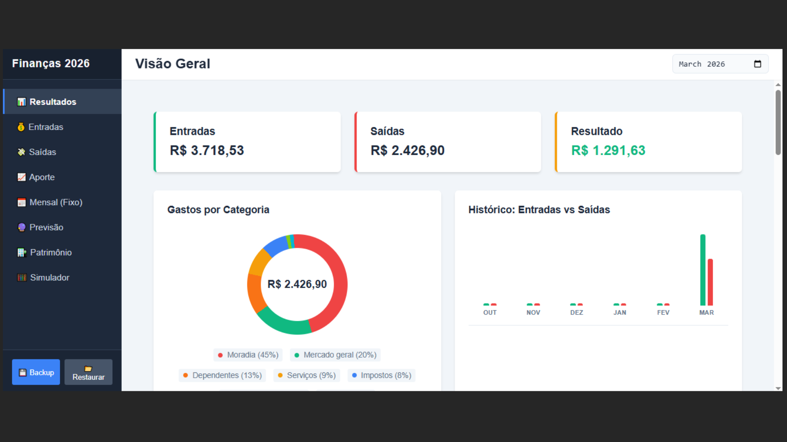
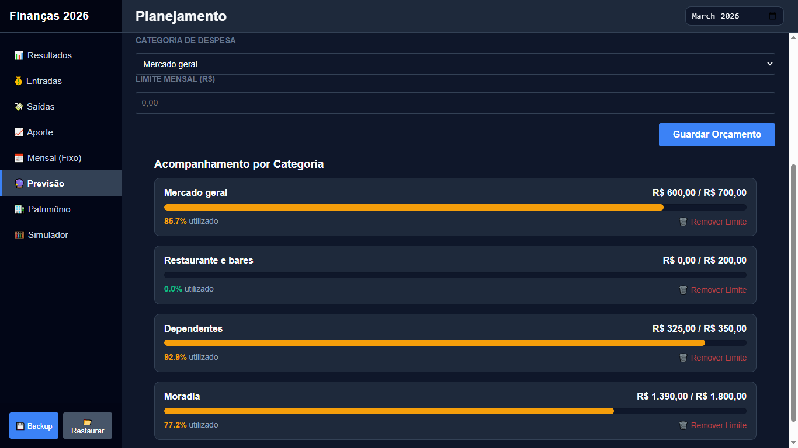
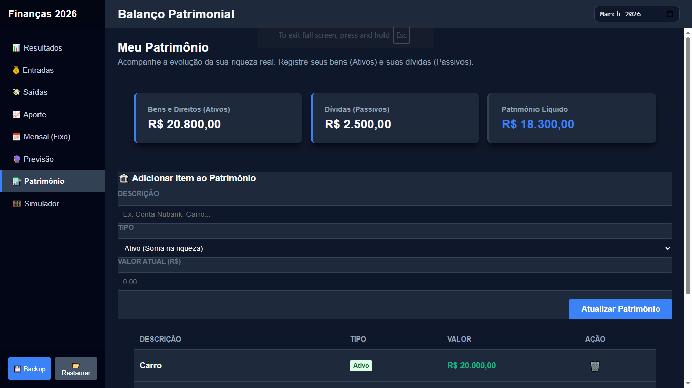

# 📊 Finanças 2026 - ERP Pessoal

.
.
.
.

Um Sistema de Gestão Financeira Pessoal (ERP) de ponta a ponta, construído do zero com foco em performance, privacidade (Local-first) e lógica de negócios. O sistema consolida ganhos, gastos, investimentos, patrimônio e previsões orçamentárias em uma única plataforma.

## 📸 Capturas de Tela (Screenshots)

### 1. Visão Geral (Dashboard)

> 
> <br>

### 2. Controle de Orçamento (Planejado vs Realizado)

> 

### 3. Gestão de Investimentos e Patrimônio

> 

### 4. Modo Mobile (Responsivo)

> _Coloque aqui um print da tela do sistema rodando na vertical (formato celular), mostrando a adaptação do CSS Grid/Flexbox._
> 

---

## 🚀 Funcionalidades Principais (Features)

- **Dashboard Inteligente:** Gráficos de rosca e barras dinâmicos renderizados com manipulação pura de DOM e CSS (sem dependência de bibliotecas pesadas como Chart.js).
- **Cálculo de Saldo Livre:** Arquitetura financeira real que separa Despesas de Aportes (Investimentos não são gastos, são ativos).
- **Contas Fixas & Recorrentes ("Lazy Loading"):** Motor em JavaScript que identifica a virada do mês e gera as contas automaticamente sem duplicar dados.
- **Previsão de Orçamento:** Definição de "Teto de Gastos" por categoria, cruzando dados reais e gerando barras de alerta (Saudável, Atenção, Estourado).
- **Balanço Patrimonial:** Acompanhamento de evolução de riqueza (Ativos vs Passivos = Patrimônio Líquido).
- **Dark Mode Nativo:** Sistema de cores escalável baseado em variáveis CSS (Design System).
- **Privacidade Total (Local-First):** Banco de dados relacional construído 100% no `localStorage` do navegador do usuário.
- **Backup & Restore:** Exportação e importação de todo o banco de dados em formato JSON.

## 💻 Tecnologias Utilizadas

O maior desafio deste projeto foi construí-lo sem depender de frameworks (como React, Angular ou Vue). Tudo foi arquitetado do zero para demonstrar domínio completo sobre as tecnologias web fundamentais:

- **** Estruturação semântica e acessibilidade.
- **** Flexbox, CSS Grid, Variáveis globais (Custom Properties) e UI/UX com transições suaves e responsividade total.
- . \* Módulos independentes e "Clean Code" (Controllers, Storage, UI Renderers).
  - Lógica de negócios complexa (Juros compostos, cruzamento de dados, algoritmos de recorrência).
  - Manipulação avançada do DOM (Criação dinâmica de tabelas e gráficos).

## 🗄️ Estrutura de Dados (Storage)

O sistema utiliza múltiplos bancos locais para simular tabelas relacionais:

- `finance_transactions`: Lançamentos do dia a dia (Entradas/Saídas).
- `finance_recurring`: Regras de contas fixas mensais.
- `finance_aportes`: Registo isolado de investimentos.
- `finance_patrimonio`: Tabela de bens (Ativos) e dívidas (Passivos).
- `finance_budgets`: Teto de gastos por categoria para a aba de Previsão.

## ⚙️ Como Executar o Projeto

Como o projeto é construído em tecnologia web nativa, não é necessária a instalação de pacotes (Node.js, NPM, etc.).

1. Clone este repositório:
   ```bash
   git clone [https://github.com/SEU_USUARIO/financas-2026.git](https://github.com/SEU_USUARIO/financas-2026.git)
   ```
